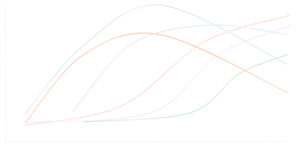
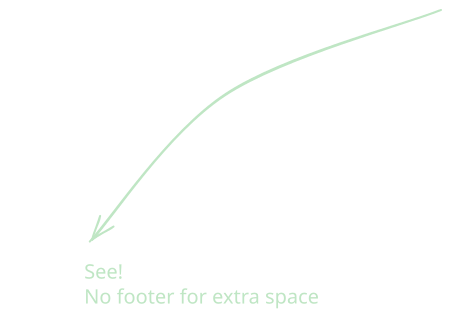

<!-- _class: title -->

# H1 Title Slide provide by the Title Class

## H2 Header for Your name

### H3 - You Don't want This

---
<!-- _class: title -->

# Title slide with custom background and logo

## See also `cpnh` theme


---

# A Typical Slide

This is what a **normal slide** will look like. *Special slides* can be set using a HTML comment and class assignment. The current classes are available:

```sh
<!-- _class: agenda -->
<!-- _class: blank-->
<!-- _class: nofooter -->
<!-- _class: multicolumn -->
<!-- _class: chapter -->
<!-- _class: end -->
<!-- _class: totalpages -->
<!-- _class: copyright -->
```

---

# What's the Plan?
<!-- _class: agenda -->

This agenda slide does not need a H1 title unless you want a different name

| Time | Description  |
| ---- | ------------ |
| 1pm  | Introduction |
| 2pm  | Presenter 1  |
| 3pm  | Presenter 2  |
| 4pm  | Snacks       |

---

# Blank Slide
<!-- _class: blank-->

This is a blank slide to show off your pretty graphs but there's no way to give it a title…



---

# That's why I Exist
<!-- _class: nofooter -->

Using the `nofooter` class will create a default slide without the slide number and footer text specified in the YAML frontmatter.



---

# Multicolumn Slide
<!-- _class: multicolumn -->

Column 1 is on one line

Column 2 is on a newline

More columns can be added for every newline<br><br>and if you want to space things out just use `<br>`

---

# Kinda Multicolumn
For partial multicolumns where you use the full slide but then need columns use the code below

<div class="multicolumn"><div>

```html
<div class="multicolumn"><div>
    column 1
</div><div>
    column 2
</div>
```
You can change column ratios using this CSS ---------------------------->
</div><div>


```css
<style scoped>
  .multicolumn{
    grid-template-columns: minmax(80%, auto) minmax(20%, auto);
    grid-gap: 0px
  }
</style>
```
</div>

---

<!-- _class: chapter -->

# This is a Nice Transition Slide
## Using `_class: chapter`

---
<!-- _class: totalpages blank-->

If you want to display the total number of slides instead of just the index, add the `totalpages` property to the slide classes.

This still needs some tweaking

---
<!-- _class: copyright blank -->

If you want to move the footer to the left corner to place a copyright symbol, set the class to `copyright` and put `©` in the footer yaml property! You can also uncomment this in the footer section of the theme css file to create something different.

```sh
    footer::before {
        content: "© ";
    }

    footer::after {
        content: " below author | text";
    }
```

---

<!-- _class: end -->

# Acknowledgements

The final slide should always be to say thanks! This slide can be set with `_class: end`. Working on improving this class.

**Name**
Position
**Department**
University | Address 1
Address 2 | Address 3
&#x1F585; [user@email.com](mailto:user@email.com)
<svg xmlns="http://www.w3.org/2000/svg" width="32" height="32" fill="currentColor" class="bi bi-github" viewBox="0 0 16 16"> <path d="M8 0C3.58 0 0 3.58 0 8c0 3.54 2.29 6.53 5.47 7.59.4.07.55-.17.55-.38 0-.19-.01-.82-.01-1.49-2.01.37-2.53-.49-2.69-.94-.09-.23-.48-.94-.82-1.13-.28-.15-.68-.52-.01-.53.63-.01 1.08.58 1.23.82.72 1.21 1.87.87 2.33.66.07-.52.28-.87.51-1.07-1.78-.2-3.64-.89-3.64-3.95 0-.87.31-1.59.82-2.15-.08-.2-.36-1.02.08-2.12 0 0 .67-.21 2.2.82.64-.18 1.32-.27 2-.27s1.36.09 2 .27c1.53-1.04 2.2-.82 2.2-.82.44 1.1.16 1.92.08 2.12.51.56.82 1.27.82 2.15 0 3.07-1.87 3.75-3.65 3.95.29.25.54.73.54 1.48 0 1.07-.01 1.93-.01 2.2 0 .21.15.46.55.38A8.01 8.01 0 0 0 16 8c0-4.42-3.58-8-8-8"/></svg> [username](https://github.com/username)

<!-- markdownlint-disable-file MD013 -->
<!-- markdownlint-disable-file MD025 -->
<!-- markdownlint-disable-file MD033 -->
